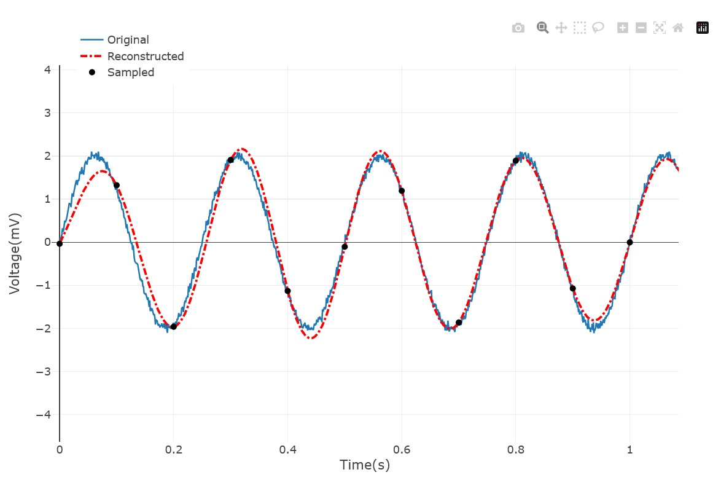

# Sampling-studio

## Project description
this project is meant to demonstrate the principals of sampling, the effect of using different sampling frequencies on the data acquisition in digital signals.

## Features:
### 1. Importing/ Saving signal as csv file

supports importing of csv file and plot it on the signal viewer
and can also save the signal displayed as a csv file.

### 2. Adding sinusoidal components of different frequencies

you can add sinusoidal components of different magnitudes and frequencies to the signal, components will be added to the drop down list and can be

### 3. Adding white gaussian noise

The application allows the user to add white gaussian noise with a controllable SNR, and then toggle it if they want to deal with the original signal

### 4. Reconstructing a signal using sinc interpolation

The program uses 1 dimensional Shannon-Whittaker interpolation to demonstrate the Nquist theorem for sampling of bandwidth limited signals.
