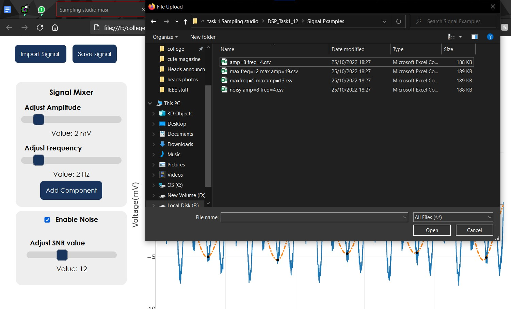
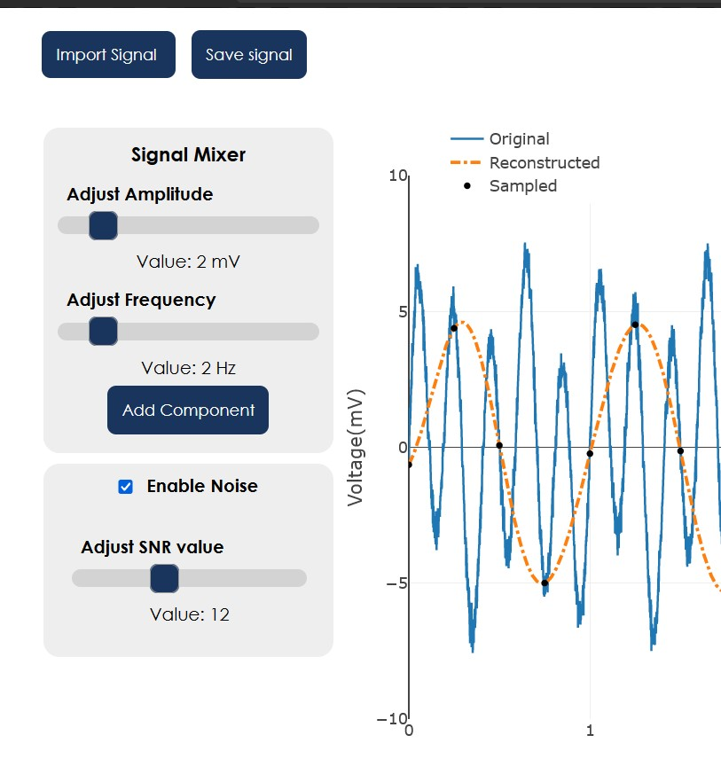

# Sampling-studio
## Task Info
Course: Digital Signal Processing \
Ph.D Tamer Basha \
for third year (first semester) \
Contributors: \
Name-                       Sec-        BN \
1- Yousef Kadry-             2-         58 \
2- Ahmed Mohamed Mahmoud-    1-         8 \
3- Ahmed Abdelmonem-         1-         5 

----------------------------------------------------

<!-- ## Table of contents:
1. [Project description](#description)
2. [Features Overview](#overview)
3. [Code explanation](#codepart) -->

## Project description 
this project is meant to demonstrate the principals of sampling and its effect on data acquisition in digital signals.

## Features overview: 
  ### 1. Importing/ Saving signal as csv file
  

  supports importing of csv file and plot it on the signal viewer
  and can also save the signal displayed as a csv file.

  ### 2. Adding sinusoidal components of different frequencies

  

  you can add sinusoidal components of different magnitudes and frequencies to the signal, components will be added to the drop down list and can be

  ### 3. Adding white gaussian noise
  

  The application allows the user to add white gaussian noise with a controllable SNR, and then toggle it if they want to deal with the original signal

  ### 4. Reconstructing a signal using sinc interpolation
  

  The program uses 1 dimensional Shannon-Whittaker interpolation to demonstrate the Nquist theorem for sampling of bandwidth limited signals.

## Project Structure:
1. `class sigProcessing()` \
  Object that stores the information related to the signal, as well as the methods used for the processes.
  1. `constructor()`
      * contains all info related to the graph object, parameters to passed to plotly.js\
      `layout{}, data{}, etc`
      * Contains the resolution and length for the original signal\
      `this.time = 5;`\
      `this.step = 0.001;`

  2. `generate(amp, f, time = this.time, step = this.step)`\
    Generates sinusoidal component using sin(wt)
  3. `sampling(samplingRate, data=this.data)`\
   Parameter for sampling rate, and data to be sampled (normal data or noisy)
  4. `reconstructSig(samplingRate)` \
  reconstructs the signal using 1Dimensional sinc interpolation
  5. `generateNoise(SNR)` \
  Generate white gaussian noise (using boxMullerTransform) based on the SNR value input
  6.`updateGraph(samplingRate, noiseOn=noiseToggle.checked)` \
  Updates the graph with the current signals, called after every click to ensure graph is refreshed \
  note: noiseToggle flag is used to check which signal to show (original/noisy)
  7.`getNormalDistRand(mean, stddev)` \
  Generates the randomly distributed numbers (by calling the `boxMullerTransform()` method)
  8. `addSignal(amp, freq)` \
  For adding component from the signal mixer onto the current signal (using user input as parameters)
  9. `deleteSignal(signalName)` \
  Calls the signal to be deleted from the signalList, then deletes it from the data

## Project file structure:

1. app.py/ _init_.py/ Route.py/ file that runs the localhost server
2. templates/ contains HTML
2. Static/
  1. /css: contains the stylesheets used
  2. /js: contains the scripts used
    1. /frame_scripts.js: Handles the interactions done on the page
    2. /processing.js: Has the class for the `sigProcessing()` object, which handles the interactions on the signal
